*
 Vikram Procter, Caleb Garcia, Graham Coleman, Devon Calvin | Feb 12, 2025 
*

# DIDSBURY DIDDLERS & Co. Est. 2006 - README

## Project Overview
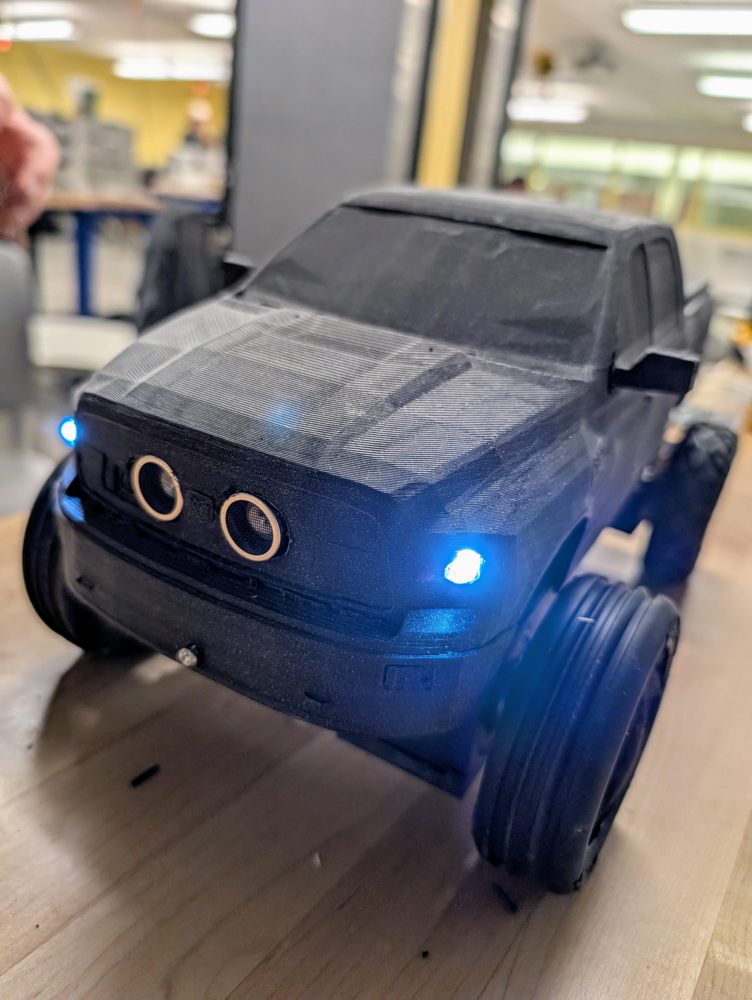

Remote control car for our ENEL 300 design class at the Schulich School of Engineering at University of Calgary.

Our car integrates a variety of features including distance measurement, metal detection, togglable head/tail lights, tank steering, and more. These features are implemented through 3 custom PCBs, designed in Altium or KiCad. Wireless locomotion control and light control is implemented using the HC-05 Bluetooth transceiver module. The physical design was inspired by a RAM 3500 Cummins 6.7 Twin Turbo and its stereotypical owner *(Devon)*. This allowed us to bring a part of Alberta culture to the academic environment through innovation and design.

## Team Dynamic
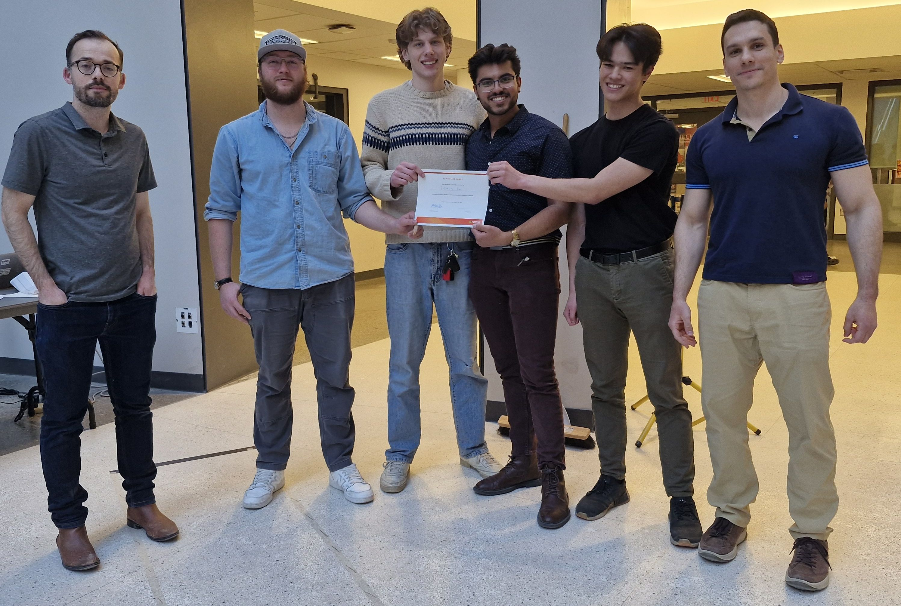  
*Image of Team Members and Professors: Dr. Philippe Gray, Devon Calvin, Graham Coleman, Vikram Procter, Caleb Garcia, and Dr. Flavio Alegretti Ramos; respectively from left to right*

The workload of the various systems was divided amongst us based on interest and skill. Coleman was responsible for implementing metal detection and distance measurement, in addition to working on Bluetooth communications, and controller design. Procter was responsible for ECU, power regulation, inter-board communication, general code management and review. Garcia was responsible for software development, 3D design and printing, and product selection. Calvin was responsible for motor driver development, 3D design, and Bluetooth communications.

## Systems Overview

The block diagram shows the operating architecture of the RC truck describing the PCB boards connections to each other. There were four custom PCBs in which 3 were used in the final design. Each board design function and integration are described in detail in the sections bellow. 

All boards excluding the controller interface with each other using an I2C bus, the ECU acts as the master on the bus and the Sensor Board/Motor Control Board act as slaves on the bus. The Controller board interfaces with the ECU alone using USART over a Bluetooth connection.

The four boards include: 
- **Controller Board** | not utilized in the final design, but would have been used within the controller to offer UI to user.
- **ECU** | Electronics Control Board, acts to integrate functionality of all other boards along with power supply regulation.
- **Sensor Board** | Finds and relays metal detection and distance sensing data.
- **Motor Control Board** | Houses motor drivers and receives data for locomotion control of vehicle.

## Sensors Systems (Sensor Board)
### Metal Detector
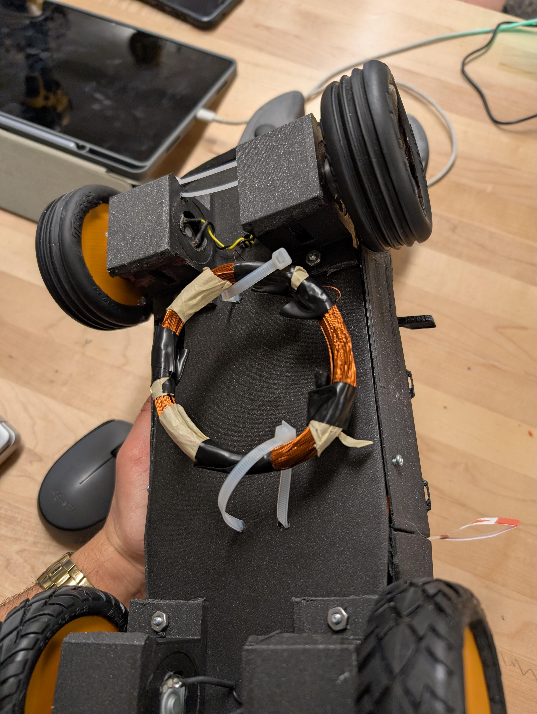

The metal detection system is designed around a 555 timer IC and inductor capacitor (LC) circuit. The 555 timer produces an AC input in which the frequency response output varies with changes in inductance. By exposing the inductor coil placed on the bottom of the car to a copper sheet the inductance of the coil changes and the frequency of the output changes in response.

The sensor board uses a built in timer module of the AVR128DB28 to measure the frequency of the LC circuit. By tuning a threshold, the recorded frequency could be used to identify if the coil was exposed to metal. This information was then relayed over I2C to the ECU.

### Distance Sensor
An ultrasonic distance sensor was used to find the distance of the nearest object in front of the car. The Sensor Board interfaced with the ultrasonic providing the appropriate 10 microsecond trigger and recording the echo. This raw echo data was transmitted over I2C to the ECU.

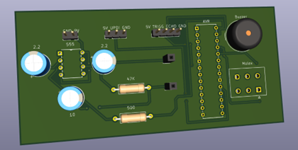  
*Render of Sensor Board PCB*

## Power Systems (ECU)
### Battery
The battery we selected has a capacity of 3000 mAh with a nominal voltage of 12.6V, this was used to supply power to all boards and the motors excluding the metal detection circuit. This battery consisted of 4 cells with integrated charging and level balancing technology.

Through estimates of maximum current draw, the runtime on one full charge was calculated to be 228 minutes. This battery was initially chosen as previously we had sourced higher power motors; these higher power motors made the battery selection more reasonable for runtime calculations. However, in switching motors we decided not to change our battery selection as it was still sufficient for operation.

### Voltage Regulation

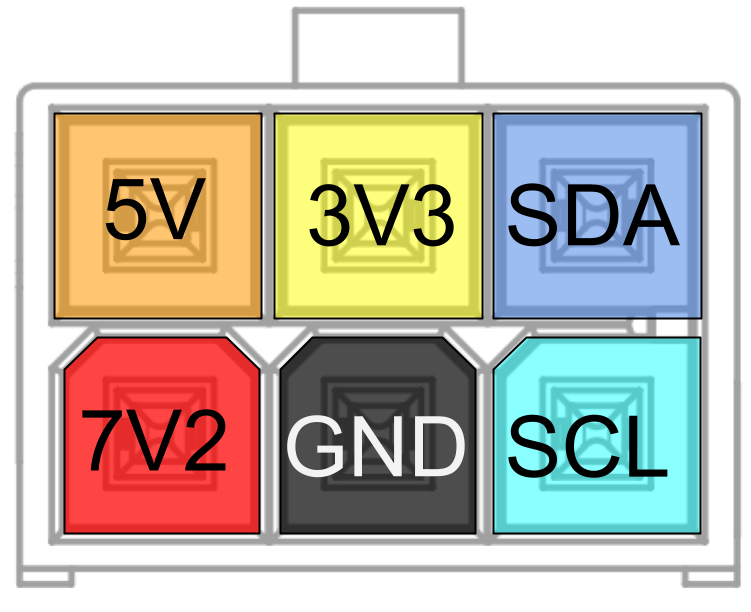  
*Custom Standard for Molex Connector*

To produce the voltage 5V and 3.3V lines linear dropout regulators (LDOs) were used. These regulators were placed on the ECU and using a custom Molex connector, voltage levels were distributed to other boards (motor control board, and sensor board).

### Power Switch
The power switch uses a PMOS high side switch topology to switch between three states: off, USB power, and battery power. For regular operation 12.6V battery is used, however for development and debugging 5V USB can be used. This switch system allows for isolation between the battery and USB for safe operation.

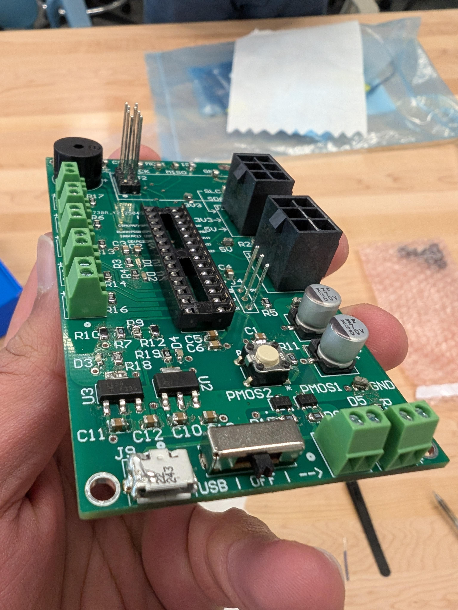  *Image of ECU Showing Power Switch*

## Communications Systems (ECU + Others)
### Bluetooth USART

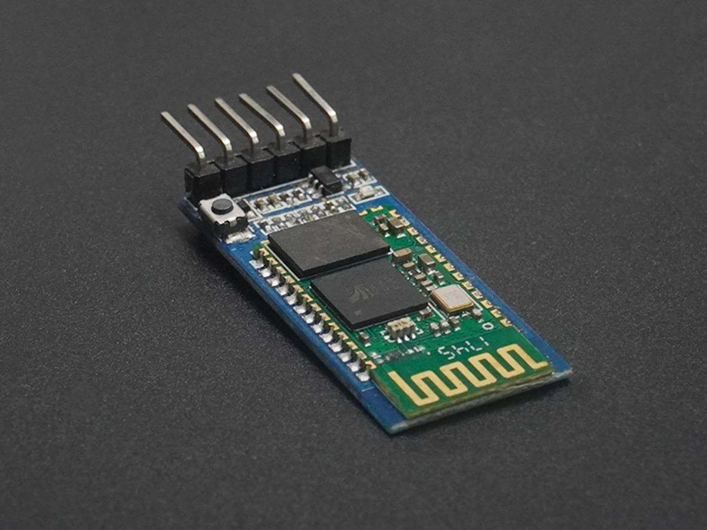

The ECU board and controller boards preformed wireless communications via a USART over Bluetooth communications module [HC-05](https://www.electronicwings.com/sensors-modules/bluetooth-module-hc-05-). The controller board would send movement control and light switch position data to the ECU board, describing positions of single axis joy sticks and if the lights should be on or not. The ECU board would send sensor data including distance and metal detection.

Three 8-bit data packets were sent from the controller. Two packets described the left and right joystick position encoded using sign magnitude. And the third packet contained the status of the light switch. 

One 8-bit packet was sent from the ECU to describe metal detection (most significant bit), and distance sensor data encoded in the 7 least significant bits. 

### I2C Inter-board Communication
An I2C bus was utilized between boards within the vehicle (ECU, Motor Board, and Sensor Board). Connection between boards was accomplished using the same custom Molex connector as described in the power regulation section.

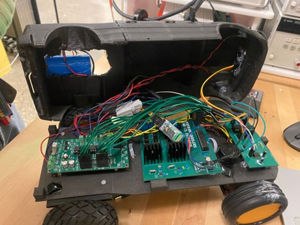

The ECU hosted the I2C bus housing the pull-up resistors and acted as the master on the bus. The ECU would relay motor control data received from the controller board to the Motor Board. The ECU would request data from the Sensor Board, receiving distance and metal detection data. I2C communications is a non-blocking function within the super loop of all boards. 

I2C packets took a very similar form to USART packets over Bluetooth. The motor board would receive two 8-bit sign-magnitude packets one for each side of the vehicle. Two packets were received from the Sensor Board. The MSB of the first packet described the metal detection data, and the remaining 15 bits described the distance sensor data. The ECU would compress the data to 7 bits before relaying to the controller.

  
*Image of ECU PCB*

## Controller

  
*3D Model of Controller*

### LCD UI
The 2x16 ASCII LCD selected was equipped with an I2C piggy-back-board to allow for fewer required pins for operation. The controller board acted as the master and LCD as slave on the I2C bus.

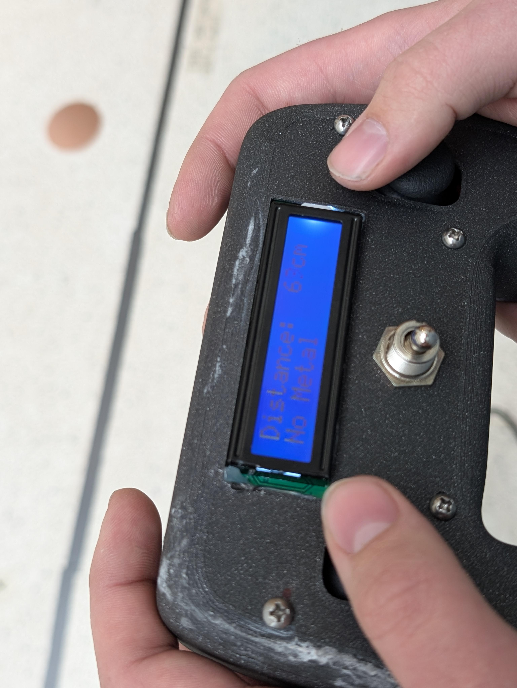

On power up the LCD would display the team name, before displaying the distance data, and metal detection data Custom functions were written to interface with the LCD to allow for ease of formatting the results on the screen, while avoiding having to do floating point calculations. 

### Inputs
The controller was equipped with two single axis joysticks for controlling locomotion and one switch for controlling the lights. The vehicle utilized a tank steering system where each joystick would control the speed of the wheels on one side of the vehicle. The joysticks function as a potentiometer, by creating a voltage divider the change in resistance as the joystick moved was recorded using an ADC on the AVR128DB28. Through the careful design of the voltage divider the AVR128DB28 was able to provide ADC input to a much higher accuracy than needed (12-bit resolution). This value was compressed and encoded to the 8-bit sign-magnitude value transmitted over I2C.

Data collected through the input devices and data required for displaying on the LCD was transmitted using USART over Bluetooth using the [HC-05](https://www.electronicwings.com/sensors-modules/bluetooth-module-hc-05-). Although data was compressed for transmission over Bluetooth, it was done in a way that retains accuracy to the level required by the project.   

*A PCB was designed for the controller however due to time and resource constraints the PCB was not assembled and the controller board was constructed using a perfboard*

## Locomotion Systems (Motor Board)
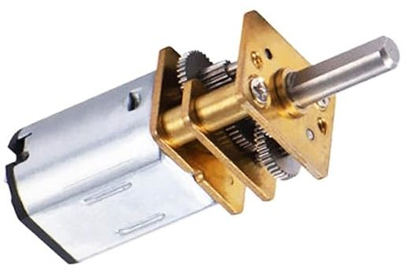

The selected motors are driven using two L298N H-Bridge motor drivers, using 12.6V supplied from the battery with inline Toshiba TCKE812NA E-Fuses for over current protection. As this is a high current board, large polygon pours were used when dealing with high current nets. Thermal reliefs were also removed to improve thermal conduction during operation and max current tolerance. As this board interfaces with large inductive loads, fly back diodes were also used. 

The Motor Control Board is also equipped with an AVR128DB28 to interface with the I2C bus and use information received to operate the motor driver ICs. The Motor Control Board receives two 8-bit packets containing the sign-magnitude values for the speeds the motors should be spinning on each side of the vehicle. To control the motor speed a PWM signal generated using the AVR128DB28 was used as an input to the enable pin of the L298N motor drivers. The 8-bit packets are decoded to find the polarity (from sign) and duty of PWM (from magnitude). 

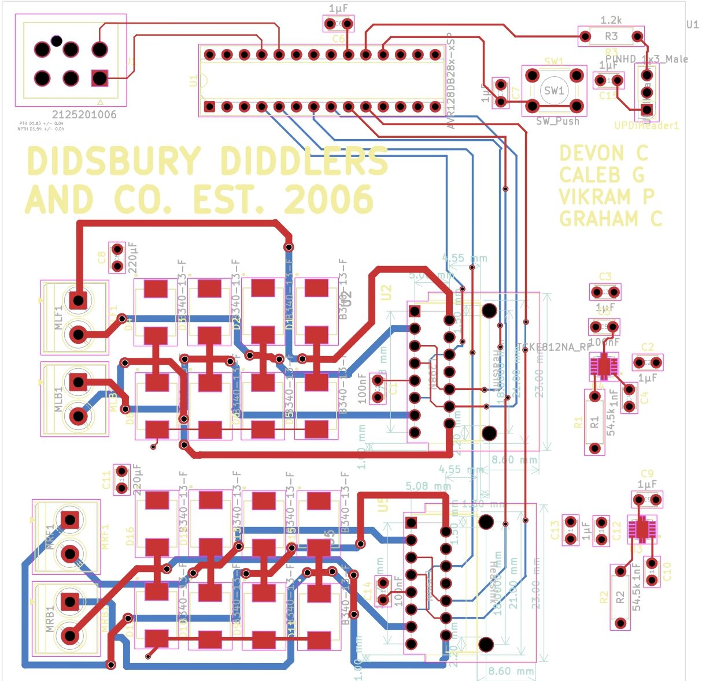

## Mechanical Design
The frame and body of the vehicle, along with the controller case was 3d printed. The frame consisted of a baseplate that custom motor bracket mounts were attached to. The frame had holes drilled for connections to motor terminals. The body was printed from a modified 3d model of a RAM 3500 found online. Wheels were also printed and off the shelf rubber tires were fitted to them. All 3d models were scaled to achieve an approximate 1:16 scale to the real truck. All prints were done in PLA, and infill was scaled based on points of high stress.  

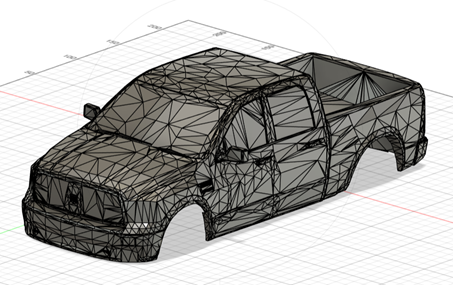  
*3D Printed Body File*