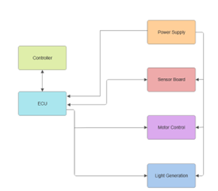

*
 Vikram Procter, Caleb Garcia, Graham Coleman, Devon Calvin | Feb 12, 2025 
*

# DIDSBURY DIDDLERS & Co. Est. 2006 - README

## Project Overview

Remote control car for our ENEL 300 design class at the Schulich School of Engineering at University of Calgary.

Our car integrates a variety of features including distance measurement, metal detection, togglable head/tail lights, tank steering, and more. These features are implemented through 3 custom PCBs, designed in Altium or KiCad. Wireless locomotion control and light control is implemented using the HC-05 bluetooth transciever module. The physical design was inspired by a RAM 3500 Cummins 6.7 Twin Turbo and its stereotypical owner *(Devon)*. This allowed us to bring a part of Alberta culture to the academic enviroment through innovatation and design.

## Team Dynamic

The workload of the various systems  was divided amongst us based on interest and skill. Coleman was responsible for implemeting metal detection and distance measurement, in addtion to working on bluetooth communications, and controller design. Procter was responsible for ECU, power regulation, interboard communication, general code management and reveiew. Garcia was responsible for sofware development, 3D design and printing, and product selection. Calvin was responsible for motor driver development, 3D design, and Bluetooth communications.

## Systems Overview

The block diagram shows the operating architecture of the RC truck describing the PCB boards connections to eachother. There were four custom PCBs in which 3 were used in the final design. Each board design function and integration are described in detail in the sections bellow. 

All boards excluding the controler interface with eachother using an I2C bus, the ECU acts as the master on the bus and the Sensor Board/Motor Control Board act as slaves on the bus. The Controller board interfaces with the ECU alone using USART over a bluetooth connection.

The four boards include: 
- **Controller Board** | not utilized in the final design, but existed within the controler to offer UI to user.
- **ECU** | Electronics Control Board, acts to integrate funcionality of all other boards along with power supply regulation.
- **Sensor Board** | Finds and relays metal detection and distance sensing data.
- **Motor Control Board** | Houses motor drivers and receives data for locomotion control of vehicle.

## Sensors Systems (Sensor Board)
### Metal Detector

The metal detection system is designed around a 555 timer IC and inductor capacitor (LC) circuit. The 555 timer produces an AC signal inwhich the frequency response varries with any changes in inductance. By exposing the inductor coil placed on the bottom of the car to a copper sheet the inducatance of the coil changes and the frequency of the output changes in response. The sensor board uses a built in timer module of the AVR128DB28 to measure the frecuency of the LC circuit.

By tuning the recorded frequency 

Before the PCB for the sensor board was designed, the main 555 timer based metal detection circuit the PCB is now based upon was breadboarded, and tested extensively. The output of the circuit, where the AVR128DB28 would take its input, was probed with an oscilloscope to confirm the frequency change was detectable, and consistent. Furthermore, because of the high voltage supply needed for the metal detector circuit — 9V — further testing and calculations were required to find an appropriate resistor value such that the AVR128DB28 input pin used did not get overloaded. No preliminary testing was done for the HC-SR04 ultrasonic sensor, due to the previous experience our group has with the sensor.

### Distance Sensor

## Power Systems
### Battery

## Communications Systems
### Bluetooth USART
### I2C Interboard

## Controller
### LCD UI
### Inputs

## Locomotion Systems
### Motor Selection
### Motor Drivers